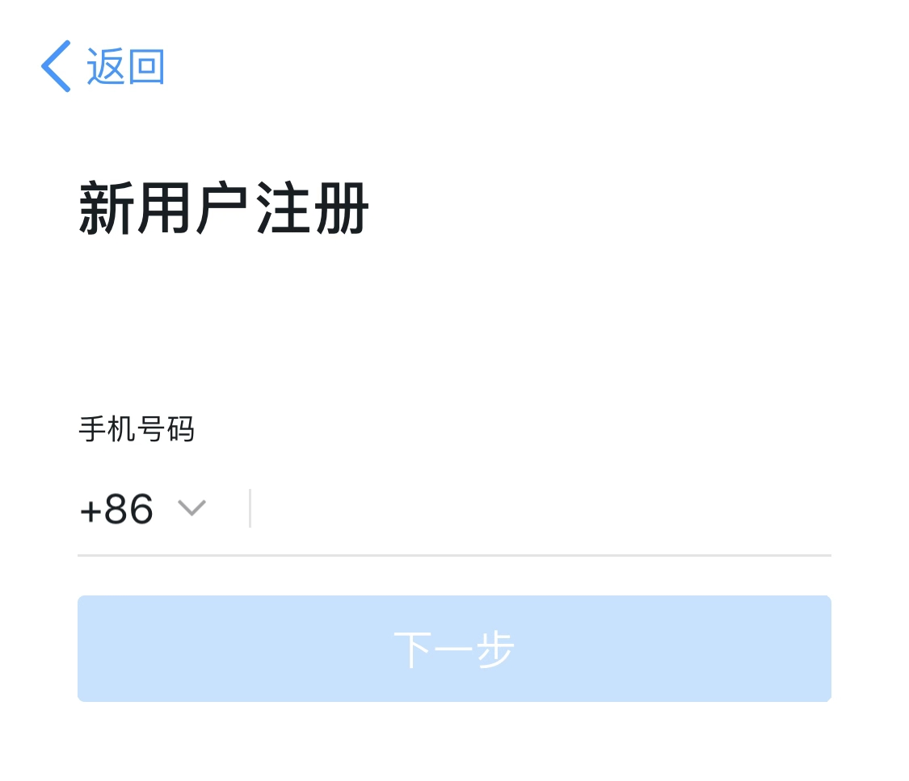
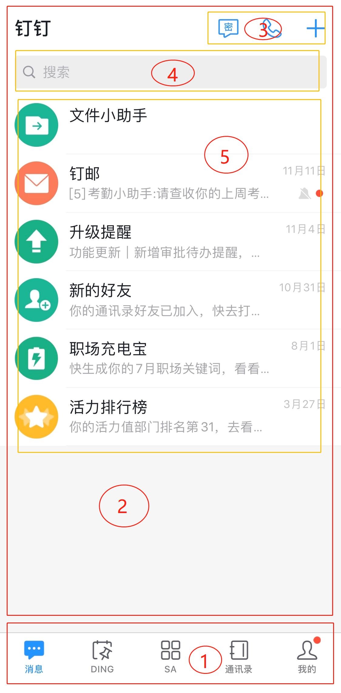
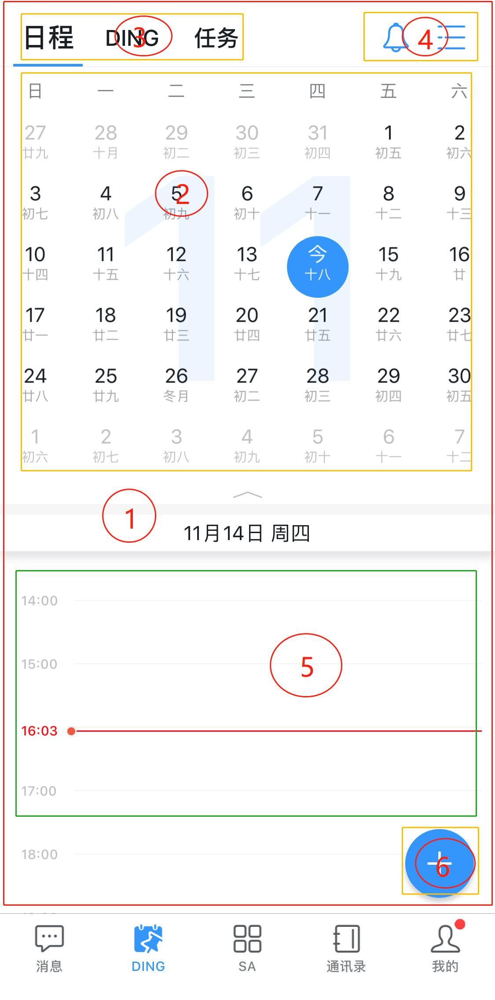
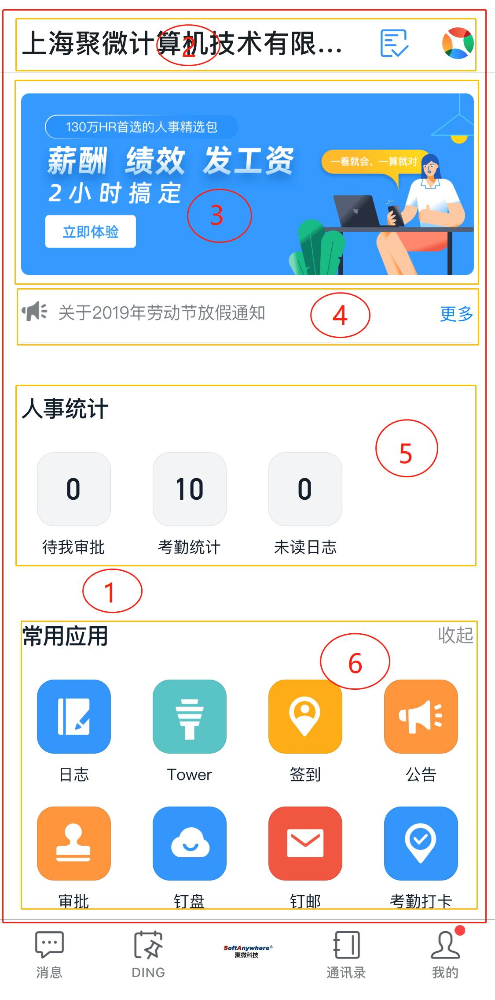
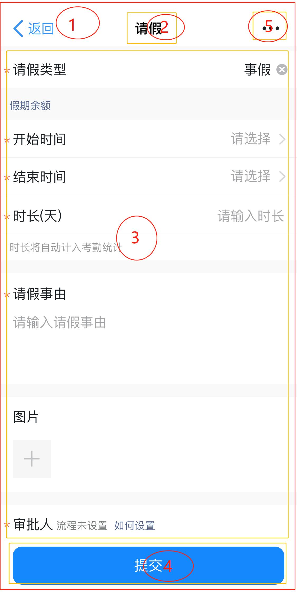

# iBiz 移动端简介

信息技术发展到今天，作为信息的载体，移动端已经是必不可少的内容结构之一。

快速开发移动端，迭代能力

移动端，信息信息载体。

快速开发

快速迭代

模型化结构。

## 技术

基于 JavaScript 的小程序

H5 独立程序应用

三大框架的技术支持，Angular、React、Vue。

## 界面

界面是 app 的主要内容，app 切换不同的界面，提高

移动端 app 界面结构说明，包括对部分功能页面和常规页面做主要结构介绍，拆解后模型化构成方式。

### 界面结构

本章节以钉钉为示例做出说明，并选取其中具备代表的几类页面，做结构拆解和模型对比。

#### 功能页面

功能页面是 app 内具有特殊使用场景的视图，如注册、登录等。

##### 注册

注册页面，是 app  的起点，打开 app 的第一步，就是注册用户信息，用户注册最简单方式，使用手机号码注册即可。另外，还可以使用邮箱注册、第三方授权注册等方式。

##### 登录

登录页面，是 app 的入口，一般在独立的 H5 app 中，回出现登录页面。作为内容被集成到其他的应用应用中，会被应用应用授权，直接使用该应用用户信息；还有不需要登录，用户可以直接访问的页面，这个步骤会被省略。

app 登录方式与用户的注册方式，切实相关。如上图所示，用户可以使用手机号码登录，还可以使用支付宝登录，两者都能给予进入 app 所需的信息，满足登录要求。

#### 常规页面 

在应用中，界面由多个部分组成，本章节将对应用内的常规视图做结构性的拆解组成说明，并将其构成模型化对比，使开发人员对移动端模型的使用场景做更加充分的理解。

> 注：本文只做选取内容的部分结构介绍，更多内容，后续持续补充。

##### 消息

消息视图，是 app 中常见的视图信息展示方式。纵向的列表数据，具备删除功能，视图允许过滤数据，并有合适操作区域等。

如上图所示，将消息界面分为由边框组成的几个主要部分，详情如下：

1. 应用级导航栏：该导航栏属于应用级导航，固定在应用底端，对应用提供的功能做最大类别的区分。在应用中，数据基本不会变化。
2. 消息视图：导航内容，该内容显示在界面中，但内容独立维护，可以在其他场景独立显示（以下简称视图）。主题提供 app 消息数据的呈现于管理。
3. 视图操作区：该区域属于消息视图，用户定义消息视图的操作节点，不包括数据操作。
4. 视图搜索区：该区域属于消息视图，搜索消息数据。
5. 视图数据内容区：该区域属于消息视图，消息数据展示。

该界面结构的划分，是基于界面内容和界面功能的特性，将其模型化后，详情如下：

| 序号 | 名称           | 模型名称               | 详情                                                         | 备注             |
| ---- | -------------- | ---------------------- | ------------------------------------------------------------ | ---------------- |
| 1    | 应用级导航栏   | 应用菜单               | [ IPSAppMenu](https://modelapi.ibizlab.cn/#/net/ibizsys/model/control/menu/IPSAppMenu) |                  |
| 2    | 消息视图       | 应用移动端多项数据视图 | [IPSAppDEMobMDView](https://modelapi.ibizlab.cn/#/net/ibizsys/model/app/view/IPSAppDEMobMDView) |                  |
| 3    | 视图操作区     | 实体工具栏控件         | [ IPSDEToolbar](https://modelapi.ibizlab.cn/#/net/ibizsys/model/control/toolbar/IPSDEToolbar) |                  |
| 4    | 视图搜索区     | 快捷搜索               |                                                              | 应用视图内部模型 |
| 5    | 视图数据内容区 | 实体移动端多项数据控件 | [ IPSDEMobMDCtrl](https://modelapi.ibizlab.cn/#/net/ibizsys/model/control/list/IPSDEMobMDCtrl) |                  |

> 注：以下章节，不再介绍序号为 1 的应用级导航栏。

##### 日历

日历视图，作为时间的管理承载体，给 app 提供完善的日历功能。

如上图所示，红色区域内，日历界面视图的主要组成有以下几个部分：

1. 日历视图：主要提供日历及日历相关功能，给用户做日程安排、事件管理等。
2. 视图日历数据：显示日历数据信息，属于日程的显示内容。
3. 视图分页：日历视图的不同内容展示，不同的分页提供不同的内容，包括日程、DING 和任务。
4. 视图消息区：日历视图消息提示栏与界面管理。
5. 日程详情：时间轴显示当前选中日期数据内容，由日历数据提供主键，该区域内容属于独立维护，是视图级内容。
6. 视图操作区：给日程详情数据信息，内部包括一系列操作逻辑。

日历视图模型化详情如下：

| 序号 | 名称         | 模型名称       | 详情                                                         | 备注                   |
| ---- | ------------ | -------------- | ------------------------------------------------------------ | ---------------------- |
| 1    | 日历视图     | 移动端日历视图 | [ IPSAppDEMobCalendarView](https://modelapi.ibizlab.cn/#/net/ibizsys/model/app/view/IPSAppDEMobCalendarView) |                        |
| 2    | 视图日历数据 | 日历部件       | [ IPSCalendar](https://modelapi.ibizlab.cn/#/net/ibizsys/model/control/calendar/IPSCalendar) |                        |
| 3    | 视图分页     | 关系分页部件   | [ IPSDRTab](https://modelapi.ibizlab.cn/#/net/ibizsys/model/control/drctrl/IPSDRTab) | 该模型未集成至日历视图 |
| 4    | 视图消息区   |                |                                                              | 该模型不存在           |
| 5    | 日程详情     |                |                                                              | 该模型不存在，建议集成 |
| 6    | 视图操作区   | 实体工具栏控件 | [ IPSDEToolbar](https://modelapi.ibizlab.cn/#/net/ibizsys/model/control/toolbar/IPSDEToolbar) |                        |

就日历视图模型而言，区域 2 和区域 6，已经是预置支持了，区域 3 、区域 4 和 区域 5 ，区域 5 可以适当补充模型结构，为日历视图提供更多的信息。

##### 门户

门户视图，是 app 中信息展示最多的之一，它是 app  数据信息的集中地点，通过不同的方式，将信息组合显示在同一个界面中，是信息的聚合点，对门户视图的布局级数据展示，都有不一样标准。

如上图所示，红色区域内，门户界面视图主要由以下一个部分组成：

1. 门户视图：主要提供多种信息的集中展示。
2. 视图标题：显示视图名称和部分操作区域。
3. 视图消息：视图静态信息区域，一般多为广告等。
4. 视图通知消息：视图动态信息区域，实时动态数据内容显示。
5. 数据统计：视图动态信息区域，实时动态数据内容显示。
6. 快捷入口：其他操作界面入口。

门户视图模型化详情如下：

| 序号 | 名称         | 模型名称             | 详情                                                         | 备注                             |
| ---- | ------------ | -------------------- | ------------------------------------------------------------ | -------------------------------- |
| 1    | 门户视图     | 应用门户视图         | [ IPSAppPortalView](https://modelapi.ibizlab.cn/#/net/ibizsys/model/app/view/IPSAppPortalView) |                                  |
| 2    | 视图标题     |                      |                                                              | 视图内部模型，操作区域模型不存在 |
| 3    | 视图消息     | 系统自定义门户门户   | [IPSSysCustomPortlet](https://modelapi.ibizlab.cn/#/net/ibizsys/model/res/IPSSysCustomPortlet) |                                  |
| 4    | 视图通知消息 | 系统实体列表门户部件 | [ IPSSysDEListPortlet](https://modelapi.ibizlab.cn/#/net/ibizsys/model/res/IPSSysDEListPortlet) |                                  |
| 5    | 数据统计     | 系统实体列表门户部件 | [ IPSSysDEListPortlet](https://modelapi.ibizlab.cn/#/net/ibizsys/model/res/IPSSysDEListPortlet) |                                  |
| 6    | 快捷入口     | 快速菜单部件         | [IPSDBMenuPortletPart](https://modelapi.ibizlab.cn/#/net/ibizsys/model/control/dashboard/IPSDBMenuPortletPart) |                                  |

门户视图在常规的使用中，对系统实体列表门户部件和系统自定义门户门户使用最多，该两个模型在显示数据的处理上，具有的优势比较大，能够通过不同界面模式，将很多数据都集合在一起。

##### 表单

在 app 中，有一类视图，是必不可少的，那就表单视图。app 数据信息录入，就需要表单视图来提供基础数据的处理。

如上图所示，红色区域内，表单界面视图主要由以下一个部分组成：

1. 表单视图：主要提供数据信息录入处理。
2. 视图标题：显示视图名称。
3. 视图表单：数据信息处理内容，提供常规的数据输入，基本模式有文本框、选择和文件处理等。
4. 视图操作区：对视图表单数据与后端做交互处理。
5. 视图操作区：对视图提供附加处理逻辑。

编辑视图模型化详情如下：

| 序号 | 名称       | 模型名称               | 详情                                                         | 备注                     |
| ---- | ---------- | ---------------------- | ------------------------------------------------------------ | ------------------------ |
| 1    | 编辑视图   | 应用实体移动端编辑视图 | [ IPSAppDEMobEditView](https://modelapi.ibizlab.cn/#/net/ibizsys/model/app/view/IPSAppDEMobEditView) |                          |
| 2    | 视图标题   |                        |                                                              | 视图内部模型             |
| 3    | 视图表单   | 实体编辑表单           | [ IPSDEEditForm](https://modelapi.ibizlab.cn/#/net/ibizsys/model/control/form/IPSDEEditForm) |                          |
| 4    | 视图操作区 | 实体工具栏控件         | [ IPSDEToolbar](https://modelapi.ibizlab.cn/#/net/ibizsys/model/control/toolbar/IPSDEToolbar) |                          |
| 5    | 视图操作区 |                        |                                                              | 附加操作逻辑，模型不存在 |

### 界面特点

上述界面结构，讲述了几个具有代表性的界面结构介绍与模型化构建对比，为我们说明了在常规的移动端界面组成，怎么合理的划分功能内容结构，这些功能结构可以通过那些模型提供内容构建的支持。

结构化拆解，过程是一个很有价值的事情。

其一，熟悉参考 app 、原型界面内容组成，做到真正的功能分区，去掉之前代码从头写到尾且不理解结构的不良习惯，有利于开发与后期维护。

其二，抽象开发人员公共业务表达能力，模型化组织视图界面内容，真正做到模型即内容的效果。

下面针对界面特点做几个方面说明。

#### 布局

界面布局分为整体布局和局部布局。

整体布局，是视图基于功能结构块组织方式，将不同的功能块放在不同的位置显示。由于移动端界面大小的限制，一般使用流式布局，即内容采取顺序由上往下排列。

局部布局，是针对功能结构块内内容的组织方式，这部分布局非常细致，要求将对于的功能块作为一个整体来考虑，隔离开整体布局的影响，完成局部布局意义。该布局示例有视图表单内容，这是一个细致化布局的内容。

就界面布局而言，有一个关键点，操作区的布局，是非常重要的一点。

移动端本身要求以用户操作为主，对操作的便利性，有了更高的要求，因为，操作区怎么存放在合适位置，在有成果示例的同时，要求开发人员也必须思考如何更好的组织操作区域内容。

因此，在视图的提高的布局模型中，建议考虑上述内容。

#### 操作区

操作区，在移动端界面中，具有不一样的意义，它是真正能够体现移动端交互能力的内容点。

内容布局合理，只能说明该界面内容展现规划适宜或内容丰富饱满，只有加上操作顺畅、处理方便，才能为移动端提供更有价值的功能点。毕竟，移动端的使用场景，主要表现在交互上。

其中，移动端界面一般具有多个操作区。根据其针对的目标的不一致，可以将其分为视图层级的操作区和主要数据层级的操作区。

视图级操作区，主要基于视图内容，做多样化的视图功能补充，完善视图功能。从某种意义上来说，它才是视图界面功能多样性的体现。

数据级操作区，则主要针对视图的数据做常规操作处理。

因此，视图操作逻辑模型结构，需要考虑到这两个部分应用场景的不一致，补充模型特定的应用能力。

